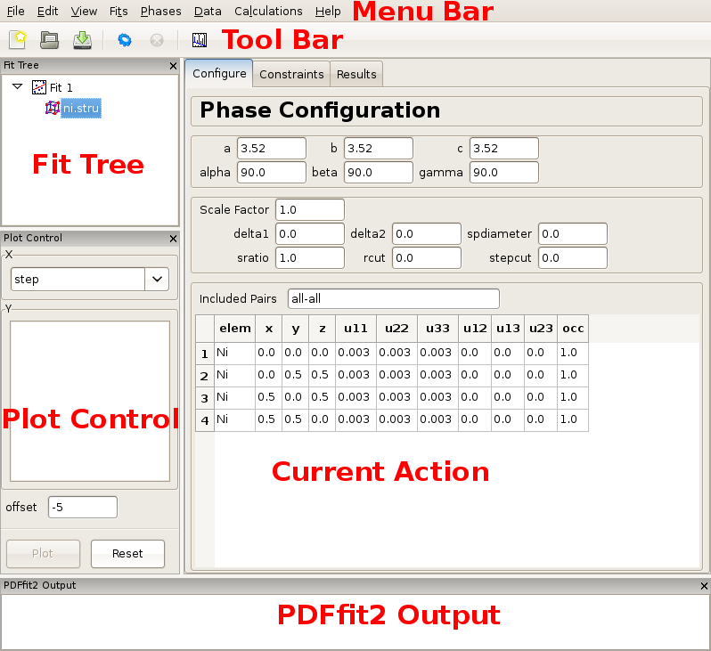

.. _tutorial:

Tutorial
########

Please, have your co-workers or students try it out and let us know if you
have any comments.  We want to make it really easy for the new users to get
started with PDFgui.

Input files:

- :download:`Ni data <manual_resources/Ni data.zip>` containing:
    1. Ni-xray.gr - experimental X-ray PDF data
    2. Ni.stru - Ni f.c.c. structure in PDFfit format

In this exercise Ni PDF data obtained using synchrotron x-ray radiation
collected at 6-ID-D at the Advanced Photon Source is used. Note that among
the exercise files there is also a file Ni-neutron.gr, obtained using neutron
radiation at the GPPD diffractometer at the IPNS facility at the Argonne
National Laboratory. Both x-ray and neutron datasets were collected at 300 K.

This manual will help you to get started with ``PDFgui``.  We strongly
recommend that that you refer to the book `Atomic pair distribution function
analysis: a primer` by Simon J. L. Billinge, Kirsten Jensen Soham Banerjee,
Emil S. Bozin, Benjamin A. Frandsen, Maxwell W. Terban and Robert J. Koch,
Oxford: Oxford University Press, 2024. URL:
https://global.oup.com/academic/product/atomic-pair-distribution-function-analysis-9780198885801
for much more extensive and detailed descriptions of carrying out fits with
PDFgui (and the related program diffpy-cmi).

=============
PDFgui layout
=============

First, open ``pdfgui``. Instructions for doing this depend on your system,
but an example would be to open a terminal, activate your pdfgui conda
environment, and type ``pdfgui`` at the prompt, or to double-click a project
file on windows.

Once PDFgui is invoked, a PDFgui window comes up. Its layout consists of a
``Menu Bar``, a ``Tool Bar``, and a set of four panes. The menu bar contains
drop-down menus that provide various aspects of PDFgui functionality.  The tool
bar features icons for commonly used operations: creating a new project,
opening an existing project, saving a project, executing a refinement or
calculation, stopping a refinement or calculation, and making a quick plot. The
four panes consist of the ``Fit Tree``, ``Plot Control``, the ``Current Action``
pane, and the ``PDFfit2 Output`` panel.

   Figure 1.1:  Appearance of a PDFgui window after a structure model  is
   loaded.

The ``Fit Tree`` is used in setting up a fit protocol. The ``Plot Control``
serves the user’s needs for graphically displaying the fits, as well as
various fit-related parameters. The content of the ``Current Action`` panel
changes as the refinement is being set up. It is a functional panel through
which the user configures the fit attributes, sets the fit constraints,
reviews the fit settings, displays fitting results, and also carries out
other setup steps. The progress of the PDFfit2 refinement engine is displayed
in the ``PDFfit2 output`` panel.

All panels except the current action panel are dockable windows that can be
dragged across the screen, resized and arranged to accommodate the individual
visual needs of the user. The window layout can also be controlled via the “
View” drop-down menu on the menu bar. An important part of the PDFgui
operativity is also conveniently available through mouse operations such as
select and right-click.

.. _lesson1:

=======================================
Lesson 1: Creating simple fit of Ni PDF
=======================================

Procedure:

1. Open ``pdfgui``.

2. Create a new Fit:

    1. In the GUI locate the ``Fit Tree`` panel.  In the default layout it is
       at the top left of the page.

    2. With your mouse on that panel, right-click the mouse and select "New
       Fit" from the pop-up menu.

    3. By default, your fit will be called ``Fit 1``. To give it a more
       meaningful name, left click the ``Fit 1`` name. It should open an
       editable box and you can type in a name for your fit such as "Fit of
       Ni structure to Ni data"

    4. Note, an alternative workflow to create a new fit is to find ``New fit
       `` under the ``Fits`` dropdown menu.

3. Load structure model:

    1. Carefully place your cursor on to the title of the Fit and right-click
       . Select "Insert Phase" from the pop-up menu.

    2. Click the "Open" button and navigate to and load the ``Ni.stru`` file
       that you downloaded.  You could select valid structure model file, a
       ``.stru`` or a ``.cif`` file.

    3. Note, an alternative workflow for adding structural models is to
       select ``New Phase`` from the ``Phases`` dropdown menu.

   If you select the Phase in the ``Fit Tree`` by left clicking on it, you
   will see in the right panel 3 tabs, ``Configure``, ``Constraints``,
   `` Results``. As shown in the Figure 1.1. Feel free to click one these
   tabs and look inside.

   The ``Configure`` panel displays configuration information from the
   structure file. The top portion contains lattice parameters, phase scale
   factor, and a set of parameters intended to be used to account for
   correlated atomic motion effects that typically sharpen the nearest
   neighbor PDF peak. These are ``delta1``, ``delta2``, ``sratio``, and
   ``rcut ``. The ``spdiameter`` and ``stepcut`` parameters include scatterer
   size effects in the PDF. These parameters will be described later. The
   bottom part of the panel contains standard unit cell content related
   information such as atomic species, their fractional coordinates,
   anisotropic ADPs, and site occupancies. The ``Constraints`` panel will
   hold the constraints we will set up for our fits, it should be empty now,
   and the results tab will contain the results of any fit.

   Note that what you see on the right is "Context Dependent", it depends on
   what you have selected on the left. By selecting a phase on the left, the
   tabs on the right contain information about that phase, and so on.

4. Load experimental PDF data:

    1. As before, hover over your cursor over the title of your fit and right-
       click.  This time select ``Insert Data Set`` from the pop-up menu.

    2. Navigate to and load the `Ni-xray.gr` file that you downloaded.

   Again, the right panel shows 3 tabs, now for properties of this dataset.

   .. figure:: images/fig2-02.png
      :align: center
      :figwidth: 100%

      Figure 1.2:  Appearance of a PDFgui window after a PDF dataset is loaded.

   The ``Configure`` panel displays configuration information from the data
   file. It should be noted that depend-ing on the software used to prepare
   the experimental PDF from the raw data, the file may (or may not) contain
   meta-data reflecting the experimental conditions and configuration. For
   example, software ``PDFgetX2`` and ``PDFgetN``, which can be used to
   prepare PDFs from x-ray and neutron total scattering experiments
   respectively, supply meta-data in the header oset configuration panel.

   Caution should be exercised by the user to verify that these data indeed
   correspond to the experimental conditions. In the present example, x-ray
   radiation is used, and so the x-ray selection is turned on for the ``
   Scatterer Type``. The ``data range``, ``fit range``,
   ``data scale factor``, ``maximum Q value`` used in Fourier transform to
   obtain the experi- mental PDF and the experiment specific parameters are
   displayed. Parameters describing experimental resolution effects,
   ``Qdamp `` and ``Qbroad``, and experimental conditions, such as
   `` temperature`` and ``doping`` (used for bookkeeping and for parametric
   plots) are also shown. If no meta-data are present in a data file, this
   information should be supplied by the user.

   Note also that the changes occurred at this stage in the plot control panel
   , allowing user to plot the data. This is achieved by selecting r in the X-
   choice box and Gobs (the observed :math:`G(r))` in the Y-list box and then
   pressing the “Plot” button. Since no fitting has occurred so far, an
   attempt to plot calculated PDF profile or a difference yields a blank plot
   . The data can also be displayed by clicking the rightmost "plot" button
   |plot| in the tool bar.

5. Define what is refined:

   Having specified the initial structure to be refined, and the data set to
   be fit, we proceed to the refinement setup. The adjustments and constraint
   setup are done on both the experimental data and the refined structure
   levels, toggling between the corresponding ``Configure`` and
   ``Constraints`` tabs.

    1. Click on the `Ni-xray.gr` data and select the ``Configure`` tab.

    2. Type "1.7" into the ``Fit Range`` edit box and "0.08" into the
       ``Qdamp`` edit box.

    .. figure:: images/fig2-03.png
	:align: center
	:figwidth: 100%

	Figure 1.3:  Adjusting data set related configuration.

  Since there is no physical information in the region of of r below the
  nearest neighbor PDF peak position (as seen in the plot), and since this
  region is often affected by noise and experimental artifacts, it is wise to
  exclude it from fitting. We therefore set the value of the lower boundary
  of the ``Fit range`` to 1.7. (Note that the units are Angstroms). In
  addition, we set ``Qdamp parameter`` to a more realistic starting value of 0
  .08. This is an instrument-dependent parameter is typically obtained
  through a conventional calibration process at each PDF experiment using a
  standard sample such as Ni or Si.

    3. select the ``Constraints`` tab.

    4. Type ``@1`` into the "Scale Factor" edit box and ``@2`` into the
       "Qdamp" edit box.

    .. figure:: images/fig2-04.png
	:align: center
	:figwidth: 100%

	Figure 1.4:  Setting up the refinement parameters and constraints of the
	structure model.

   Here we are defining "variables" that will be refined and giving them names
   variable "@1", "@2", etc. and linking them to model parameters by typing them
   in the text-box associated with the parameter.  So by typing ``@1`` in the
   data "Scale-Factor" text box we are saying that we are logically assigning
   the constraint equation ``data.scale_factor = variable("@1")``.

    5. Select the `Ni.stru` phase, adjusting the initial parameter values if
       necessary (not done here) and proceeding to ``Constraints`` tab.

    6. Fill "a", "b", "c" boxes with ``@3``. Fill "u11", "u22", "u33" cells
       with ``@4``.

    .. figure:: images/fig2-05.png
	:align: center
	:figwidth: 100%

	Figure 1.5:  Setting up the refinement parameters and constraints of the
	PDF data.

   When we assign the three parameters ``a``, ``b`` and ``c`` to the same
   variable, ``@2``, we are implicitly ensuring that the refinement will
   respect the cubic symmetry of the nickel structure and that ``a = b = c``,
   because the three parameters are assigned to the same variable, so however
   much ``a`` is changed in the refinement, ``b`` and ``c`` will be changed
   by the same amount. Note that the variable ensures that changes to ``a``,
   ``b`` and ``c`` are always the same, so we have to also ensure that the
   initial values of ``a``, ``b`` and ``c`` are the same as each other to
   ensure that the structure is cubic and remains so.

   Also, isotropic ADPs are assigned to all Ni atoms in the refined cell as
   refinement parameter ``@4``. This can conveniently be done by highlighting
   the “u11”, “u22” and “u33” cells for all four atoms, and typing ``@4`` .

   PDFgui allows us to express more complex constraint equations than
   simply assigning a parameter to a variable.
   In general, we can type into be Constraints tab text box any math expression:
   ``f(@n1, @n2, @n3, ...)`` where
   ``@n1`` stands for the fitted parameter, where it is understood that
   ``n1, n2, ...`` are arbitrary positive integers.
   This allows simple linking of related variables.  For example, if we want
   to allow a crystallographic site to contain either Ni or Pt, we don't know
   how much Ni or Pt is on the site, but we want it to be always fully
   occupied, we could create two lattice site entries with the same
   fractional coordinates, with one assigned Ni as the element and the other
   assigned Pt as the element. Then we could assign the Ni occupancy as
   ``@100``.  Then typing ``1-@100`` into the constraint text box of the Pt
   occupancy ensures that however much the occupancy of the Ni site goes down
   in a refinement, the occupancy of the Pt on that same site goes up by the
   same amount.  This ensures full occupancy of that site, as long
   as the initial occupancies of the Ni and Pt added up to 1.

6. Start the refinement:

    1. Select the fit to run by left clicking the title of the fit in the
       ``Fit Tree`` panel. The ``Parameters`` panel on the right shows a list
       of variables that you have defined and their initial values.  Each one
       also has a check-box that allows you to fix them (prevent them from
       varying in the subsequent refinement).  Unchecked boxes mean the
       variable will be refined.

    .. figure:: images/fig2-06.png
	:align: center
	:figwidth: 100%

	Figure 1.6:  Reviewing the fit parameters and conditions.

    2. When you are satisfied with the configuration, click the "gear" icon
       |gear| on the toolbar and watch the fit progress in the terminal window.
       The refinement can be stopped prematurely by clicking on the “stop”
       icon |stop| on the tool bar. During the refinement the refinement
       progress will be directly reported in the PDFfit2 Output panel.

       After the fitting is completed, the fit summary is provided in the “
       Results” tab of the current action panel associated with the fit node.

    .. figure:: images/fig2-07.png
	:align: center
	:figwidth: 100%

	Figure 1.7:  Refinement progress is displayed in the PDFfit2 Output
	panel.

    3. If the fit results are acceptable, one or more refined values could be
       copied to become new initial parameters for possible further refinement,
       where appropriate. This is be done in the ``Parameters`` tab of the
       fit by highlighting refined parameters to be copied, right-clicking,
       and and selecting "Copy Refined To Initial".

    .. figure:: images/fig2-08.png
	:align: center
	:figwidth: 100%

	Figure 1.8:  Updating the set of initial values of refined parameters.

7. Plot the results:

    1. Select the data in the fit (in this case the `Ni-xray.gr` dataset) by
       left clicking it.

    2. Click the "plot" icon |plot| in the toolbar.

    A new window pops up with the plots. It will show the data in blue, the
    best-fit model curve in red, and offset below, the difference curve in
    green. The offset of the difference curve appears at a default value of
    ``-5.0``.  You can make your plot more pretty and meaningful by typing a
    different offset into the ``offset`` text box and hitting "plot" |plot|
    again.

    Depending on whether the structure or the data are selected on the fit
    tree, either refined structural parameters or the experiment related
    parameters and fit could be plotted.

    It is also possible to configure the plot in the ``Plot Control`` panel
    in the GUI. In the default layout it will be at the lower-left of the GUI
    panel.

    1. To plot the fit (as was done above) select "r" as the X plotting
       variable.

    2. Hold down shift and select "Gcalc" and "Gtrunc" as the Y plotting
       variables.

    3. Click the "Plot" button.

    This panel allows more plotting options for advanced cases such as
    plotting the values of parameters refined across multiple fits to extract
    temperature dependent information.

    .. figure:: images/fig2-09.png
	:align: center
	:figwidth: 100%

        Figure 1.9: An example of PDFgui plotting capabilities:  displaying a
	fit.

    .. figure:: images/fig2-10.png
	:align: center
	:figwidth: 100%

        Figure 1.10: An example of PDFgui plotting capabilities:  displaying
	a parameter.

8. Save your project for later use.

    The project can be saved at any stage in its present configuration
    through choice of Save Project as or Save Project as appropriate from the
    ``File`` drop-down menu. The PDFgui project file has “ddp” extension. In
    addition to saving a project, various parts of the project, both
    structure related and data related, can be exported to external files by
    making an appropriate selection from the ``Phases`` and ``Data`` drop-
    down menus. The phases (starting or converged) can be saved in one of
    many formats. The model PDF profile can be exported through ``Data`` menu
    and will be saved as a five-column “.fgr” file. The first four columns
    are :math:`r, G(r), dr, \text{and }dG(r)`, and the fifth column is the
    difference curve between the data and the model. Note that the model PDF
    and the difference are only calculated within the user-specified fitting
    range.

=========================================================
Lesson 2: Building structure model using crystal symmetry
=========================================================

In the previous example the initial structure was defined by an existing file
. However, PDFgui makes it very easy to build a structure model from scratch
and constrain it with arbitrary crystal symmetry.

1. Create a blank structure:
    1. Click the "Fitting" tab.
    2. Repeat steps 1-3a from Lesson 1, but choose the "New" button. Rename
       "New Phase" to "Ni fcc".

2. Define asymmetric unit:
    1. Right click the header of the empty atoms grid in the "Configure" page.
    2. Insert 1 atom using the popup menu.
    3. Change the elem cell to "Ni".
    4. Select the u11-u33 cells and type "0.004" and press Enter.

3. Expand to all equivalent positions:
    1. Right click the first Ni atom and select "Expand space group". A "
       Space Group Expansion" dialog should open.
    2. In the dialog, select Fm-3m or just type 225 in the "Space Group" box
       and hit "OK".

   You should now have four atoms in the atoms grid.

    .. figure:: images/fig3-01.png
	:align: center
	:figwidth: 100%

	Figure 1.11:  Expanding the unit cell using space group information.

4. Generate symmetry constraints:
    1. Select the "Constraints" tab.
    2. Select all atoms. This can be done by dragging the mouse over the atom
       names or by clicking on the "elem" header.
    3. Right click in a selected cell and select "Symmetry constraints." A "
       Space Group Constraints" dialog should open.
    4. "Fm-3m" should already appear in the "Space Group" box. If it does not
       , select it as you did in step 3 and hit "OK".

   The u11-u33 cells should all read the same value. The "x", "y" and "z"
   cells should be all empty because Ni atoms are at special positions in Fm-
   3m. You may try to select lower-symmetry space and check what happens with
   the constraints. The space group constraints may be mixed by selecting
   different groups of atoms, for example, when only certain species show
   lowered symmetry.

   It is important to
   note that the table reflecting constraints is the only place that program
   refers to for the symmetry. What is written there will be used, and if the
   table is tampered with, then the original symmetry obtained using symmetry
   expansion feature will not be preserved. Therefore, the expansion tool
   represents a convenience tool and nothing more than that.

5. Continue the fit as in Lesson 1.

==========================================
Lesson 3: Calculating PDF from a structure
==========================================

There is often a need for obtaining a calculated PDF profile for a given
structure instead of performing a fit. Suppose that we have a Ni structure
populating a fit tree, and that we would like to calculate Ni PDF using
neutron radiation.

1. Highlight the Ni structure on fit tree.
2. Either right-click and select Insert Calculation or select New Calculation
   from “Calculation” menu.
3. select "Neutron scatterer type", choose 0.01 for the r-grid size, and use
   0 .08 and 25.0 for resolution and maximum momentum transfer parameters
   respectively.

    .. figure:: images/fig3-03.png
	:align: center
	:figwidth: 100%

	Figure 1.12:  An example of the calculation configuration panel.

Conditions to be specified include radiation type, calculation range and
corresponding r-grid size, as well as instrument resolution and maximum
momentum transfer parameters. For the later two, the default values of
parameters could be used, or values could be specified that closely mimic the
experimental conditions on some particular instrument of interest.

4. Press "gear" icon |gear| in the tool bar. Alternatively select Run
   Selected Calculation from the “Calculations” menu.

5. Click the "plot" icon |plot| in the toolbar.

6. To export the calculated PDF, use the Export Selected Calculation choice
   on the “Calculations” menu.

=============================
Lesson 4: Multi-stage fitting
=============================

Learn how to string together fits.

1. Create a fit as in Lesson 1.
   

2. Copy the fit:
    1. Right click on the fit name "Fit 1" in the right panel (the fit tree).
    2. Select "Copy" from the pop-up menu.

3. Paste the fit:
    1. Right click in the empty space between the first fit in the fit tree.
    2. Select "Paste Fit." This will create "Fit 1_copy", a copy of "Fit 1"
       in the fit tree.

4. Link the fits:
    1. Click on "Fit 1_copy" in the fit tree.
    2. In the "Parameters" panel, select the entire "Initial" column.
    3. Type ``=Fit 1`` and then press Enter. The "Initial" values of the
       parameters should now read ``=Fit1:n``, where "n" is the index of the
       parameter.

   This is the linking syntax: ``=name:index``.
   "name" is the name of another fit.
   "index" is the index of a parameter in that fit.
   If you omit "index", it will default to the index of the parameter you are
   linking from. A linked parameter uses the refined value of the link as its
   initial value. This is useful when you are running several related fits.
   An example of this is shown below.

    .. figure:: images/fig3-04.png
	:align: center
	:figwidth: 100%

	Figure 1.13:  An example of linked fits.

5. Add more fit parameters:
    1. Select the "Constraints" tab of the `Ni.stru` phase below "Fit 1_copy".
    2. Write ``@9`` in the ``delta2`` box.

6. Run the fit and plot the results:
    1. Hold down Control and select the data sets from "Fit 1" and
       "Fit 1_copy". Alternately, select a single fit and hit “Ctrl”+“Shift”+“A”
       simultaneously on the keyboard.
    2. Press "gear" icon |gear| in the tool bar.
    3. Change the offset in the plotting window to 0 and plot Gcalc versus r.

    Notice that Once the when running the fits by pressing the “gear” icon
    |gear|, only the highlighted fits will be executed. The fitting will
    proceed in stages, so the first fit is executed first, and, after it is
    converged, the second one.

``delta2`` is a quadratic atomic correlation factor, a parameter related to
the correlated motion of atoms, and as such should help in sharpening up the
nearest neighbor PDF peak in the model PDF profile.

We note here that there is also a linear atomic correlation factor
``delta1``. This one is appropriate to use in cases of high temperature,
while ``delta2`` is more appropriate for the case of low temperatures. An
alternative way to include the correlated motion effects on PDF is to
introduce ``sratio`` parameter that defines low-r to high-r PDF peak ratio,
and ``rcut`` limit needs to be specified that defines a cutoff distance. The
two approaches of accounting for correlated motion should not be used
simultaneously. See the PDFgui publication and references therein for a more
thorough description of these parameters.

==========
References
==========

1. :download:`(pdf) <Proffen-jac-1999.pdf>`,
   Th. Proffen and S. J. L. Billinge, PDFFIT a program for full profile
   structural refinement of the atomic pair distribution function, J. Appl.
   Crystallogr. 32, 572-575 (1999)

2. :download:`(pdf) <Farrow-jpcm-2007.pdf>`,
   C. L. Farrow, P. Juhas, J. W. Liu, D. Bryndin, J. Bloch, Th. Proffen and
   S. J. L. Billinge, PDFfit2 and PDFgui: Computer programs for studying
   nanostructure in crystals, J. Phys.: Condens. Matter 19, 335219 (2007)

.. |stop| image:: images/stop-icon.png
