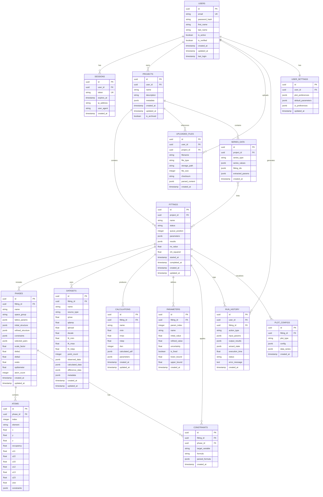

# pdfGUI Database Schema - ER Diagram

## Entity Relationship Diagram (Mermaid)



## Table Descriptions

### Core User Management

#### USERS

Primary user account table with authentication details.

- `password_hash`: bcrypt hashed password
- `is_verified`: Email verification status
- `is_active`: Account active/deactivated status

#### SESSIONS

JWT token sessions for stateless authentication.

- `token`: JWT access token
- `expires_at`: Token expiration timestamp
- Supports multiple concurrent sessions per user

### Project & Fitting Structure

#### PROJECTS

Top-level container for refinement work.

- `metadata`: Additional project info (origin, notes, version)
- `is_archived`: Soft delete for completed projects

#### FITTINGS

Individual refinement jobs within a project.

- `status`: PENDING, QUEUED, RUNNING, COMPLETED, FAILED, CANCELLED
- `queue_position`: Position in execution queue
- `parameters`: All parameter values as JSON
- `results`: Fitting results including Rw, chi-squared
- `rw_value`: Final residual value
- `chi_squared`: Goodness of fit metric

#### PHASES (Crystal Structures)

Crystal structure models for PDF fitting.

- `lattice_params`: {a, b, c, alpha, beta, gamma}
- `initial_structure`: Starting atomic positions
- `refined_structure`: Optimized atomic positions
- `constraints`: Parameter constraints as equations
- `selected_pairs`: Pair selection flags for PDF calculation
- `scale_factor`, `delta1`, `delta2`, `sratio`, `spdiameter`: PDF-specific parameters

#### ATOMS

Individual atoms within a phase structure.

- `x, y, z`: Fractional coordinates
- `u11-u23`: Anisotropic displacement parameters
- `uiso`: Isotropic displacement parameter
- `constraints`: Per-atom parameter constraints

#### DATASETS

Experimental PDF data for fitting.

- `source_type`: 'N' (neutron) or 'X' (X-ray)
- `qmax`, `qdamp`, `qbroad`: Instrument parameters
- `dscale`: Data scaling factor
- `fit_rmin`, `fit_rmax`, `fit_rstep`: Fitting range
- `observed_data`: {robs: [], Gobs: [], dGobs: []}
- `calculated_data`: {rcalc: [], Gcalc: []}
- `difference_data`: Gobs - Gcalc

#### CALCULATIONS

Theoretical PDF calculations.

- `rmin`, `rmax`, `rstep`: R-grid parameters
- `rlen`: Number of calculated points
- `calculated_pdf`: {r: [], G: []}

### Parameter & Constraint System

#### PARAMETERS

Refinable parameters with bounds.

- `param_index`: Unique parameter identifier (@1, @2, etc.)
- `is_fixed`: Whether parameter is fixed during refinement
- `lower_bound`, `upper_bound`: Parameter constraints

#### CONSTRAINTS

Mathematical constraints linking parameters.

- `target_variable`: What is being constrained (e.g., 'lat(1)', 'x(2)')
- `formula`: Constraint equation (e.g., '@1 + 0.5')
- `parsed_formula`: Pre-parsed AST for evaluation

### File & History Management

#### UPLOADED_FILES

User uploaded structure and data files.

- `file_type`: 'stru', 'pdb', 'cif', 'xyz', 'gr', 'dat', 'chi'
- `storage_path`: Server file system path
- `checksum`: SHA-256 for integrity verification
- `parsed_content`: Pre-parsed file content

#### RUN_HISTORY

Complete audit trail of user actions.

- `action_type`: CREATE_FIT, RUN_REFINEMENT, MODIFY_PARAMS, etc.
- `wizard_state`: Complete wizard form state (JSON)
- `input_params`: All input parameters
- `output_results`: All outputs and results
- `execution_time`: Duration in seconds

### User Preferences & Visualization

#### USER_SETTINGS

Per-user preferences and defaults.

- `plot_preferences`: Default colors, styles, formats
- `default_parameters`: Default fitting parameters
- `ui_preferences`: Theme, layout, shortcuts

#### PLOT_CONFIGS

Saved plot configurations.

- `plot_type`: 'pdf', 'structure', 'parameters', 'series'
- `config`: Axis ranges, colors, labels, etc.
- `data_series`: Which data to plot

#### SERIES_DATA

Temperature or doping series metadata.

- `series_type`: 'temperature' or 'doping'
- `series_values`: [300, 350, 400, ...] K or [0.0, 0.1, 0.2, ...]
- `fitting_ids`: Associated fitting UUIDs
- `extracted_params`: Parameter evolution across series

## Indexes

```sql
-- User lookups
CREATE INDEX idx_users_email ON users(email);
CREATE INDEX idx_sessions_token ON sessions(token);
CREATE INDEX idx_sessions_user_id ON sessions(user_id);

-- Project queries
CREATE INDEX idx_projects_user_id ON projects(user_id);
CREATE INDEX idx_fittings_project_id ON fittings(project_id);
CREATE INDEX idx_fittings_status ON fittings(status);

-- Structure queries
CREATE INDEX idx_phases_fitting_id ON phases(fitting_id);
CREATE INDEX idx_atoms_phase_id ON atoms(phase_id);
CREATE INDEX idx_datasets_fitting_id ON datasets(fitting_id);

-- History and audit
CREATE INDEX idx_run_history_user_id ON run_history(user_id);
CREATE INDEX idx_run_history_fitting_id ON run_history(fitting_id);
CREATE INDEX idx_run_history_created_at ON run_history(created_at);

-- File lookups
CREATE INDEX idx_uploaded_files_user_id ON uploaded_files(user_id);
CREATE INDEX idx_uploaded_files_project_id ON uploaded_files(project_id);
```

## Data Types & Constraints

### Status Enums

```sql
CREATE TYPE fitting_status AS ENUM (
    'PENDING', 'QUEUED', 'RUNNING',
    'COMPLETED', 'FAILED', 'CANCELLED'
);

CREATE TYPE source_type AS ENUM ('N', 'X');

CREATE TYPE series_type AS ENUM ('temperature', 'doping');

CREATE TYPE action_type AS ENUM (
    'CREATE_PROJECT', 'CREATE_FIT', 'IMPORT_STRUCTURE',
    'IMPORT_DATA', 'MODIFY_PARAMS', 'ADD_CONSTRAINT',
    'RUN_REFINEMENT', 'EXPORT_RESULTS', 'GENERATE_PLOT'
);
```

### JSONB Schemas

#### lattice_params

```json
{
  "a": 5.53884,
  "b": 5.53884,
  "c": 5.53884,
  "alpha": 90.0,
  "beta": 90.0,
  "gamma": 90.0
}
```

#### observed_data

```json
{
  "robs": [0.01, 0.02, ...],
  "Gobs": [-0.5, -0.3, ...],
  "dGobs": [0.01, 0.01, ...]
}
```

#### wizard_state

```json
{
  "current_step": 3,
  "completed_steps": [1, 2],
  "form_data": {
    "step1": {...},
    "step2": {...}
  }
}
```

## Storage Estimates

| Table          | Rows/User/Year | Avg Row Size | Storage/User/Year |
| -------------- | -------------- | ------------ | ----------------- |
| users          | 1              | 500 B        | 500 B             |
| projects       | 50             | 1 KB         | 50 KB             |
| fittings       | 500            | 10 KB        | 5 MB              |
| phases         | 1,000          | 50 KB        | 50 MB             |
| atoms          | 50,000         | 200 B        | 10 MB             |
| datasets       | 500            | 500 KB       | 250 MB            |
| run_history    | 10,000         | 5 KB         | 50 MB             |
| uploaded_files | 200            | 100 KB       | 20 MB             |

**Total: ~400 MB/user/year** (excluding actual file storage)
